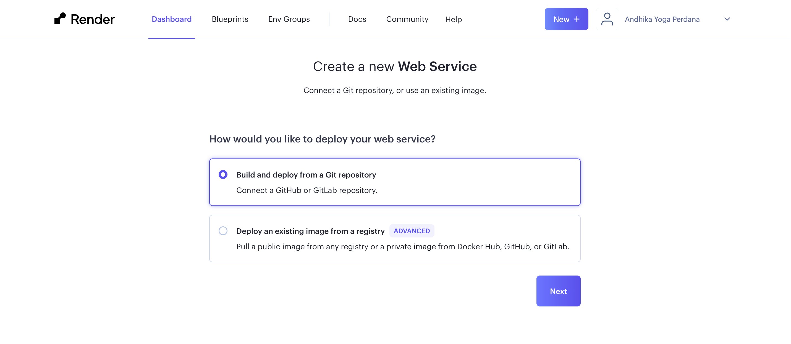
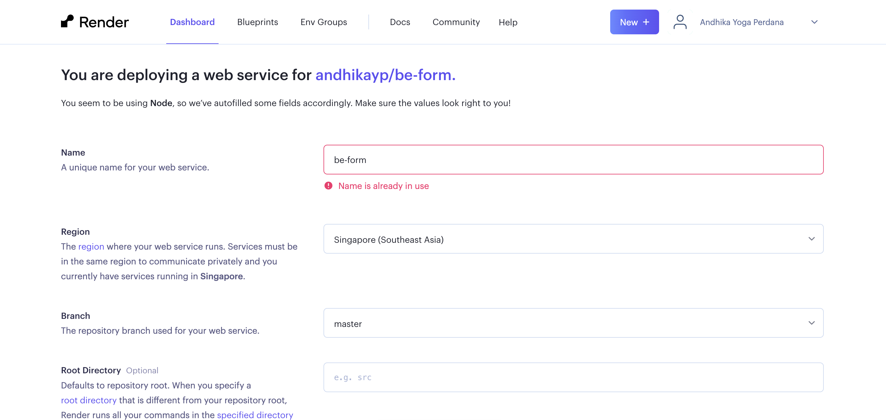

# Documentation

## Api spec
### register user
endpoint: POST /api/users
request body:
```
{
  "username": "testing",
  "password": "secret1234",
  "confirmPassword": "secret1234",
  "name": "Bob Alice",
  "email": "bob@gmail.com",
  "phoneNumber": "+6281252252252"
}
```
response body (success):
```
{
  "data": {
    "username": "testing",
    "name": "Bob Alice",
    "email": "bob@gmail.com",
    "phoneNumber": "081252252252",
    "password": "hash(password)",
    "confirmPassword": "hash(confirmPassword)"
  }
}
```
response body (failed):
```
{
  "errors": [{
    "code": "too_small",
    "path": ["username"],
    "message": "Username must be at least 6 characters long"
  }]
}
```

## Form validation

Form validation is handled from frontend and backend

```
const REGISTER = z
  .object({
    username: z
      .string()
      .min(6, { message: 'Username must be at least 6 characters long' })
      .max(30, { message: 'Username must be at most 30 characters long' })
      .and(startsWithLetterSchema)
      .and(validCharactersSchema),
    email: z.string().min(1, { message: 'Email has to be filled' }).email(),
    password: z
      .string()
      .min(8, { message: 'Password must be at least 8 characters long' })
      .max(100, { message: 'Password must be at most 100 characters long' }),
    confirmPassword: z
      .string()
      .min(8, {
        message: 'Confirm password must be at least 8 characters long',
      })
      .max(100, {
        message: 'Confirm password must be at most 100 characters long',
      }),
    name: z
      .string()
      .min(1, { message: 'Name has to be filled' })
      .max(100, { message: 'Name must be at most 100 characters long' })
      .regex(/^[a-zA-Z\s]*$/, 'Name must contain only letters and blank spaces'),
    phoneNumber: z
      .string()
      .min(10, {
        message: 'Phone number must be at least 10 characters long',
      })
      .max(12, { message: 'Phone number must be at most 12 characters long' })
      .regex(/^[0-9]+$/, {
        message:
          'Phone number must be a valid indonesian number',
      }),
  })
  .refine((data) => data.password === data.confirmPassword, {
    message: 'Password must match',
    path: ['confirmPassword'],
  });
```

## Question

##### 1. Explain how to deploy the website in the webhoster!

I deploy it on render - https://dashboard.render.com/
Step to deploy:
1. Login to render using github
2. On the dashboard, add new project that want to deploy
3. Choose web service option
3. Import from git repository and select the repository

4. Configure project

5. Klik deploy and wait until success

## Result

https://be-form.onrender.com
##### reminder: it's a free web service. we need to be patient in waiting for it
